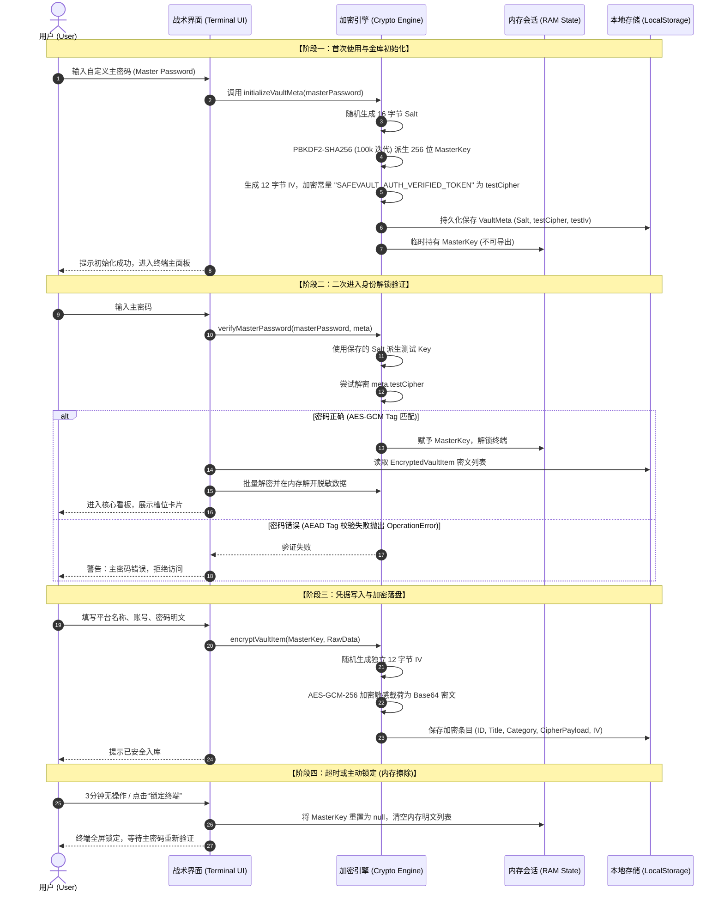

# SafeVault 个人私密密码保险箱系统详细设计说明书 (SDD)

> **项目名称**：SafeVault 个人私密密码管理小程序  
> **文档版本**：v1.0.0-Release  
> **编制依据**：《基于大语言模型的软件与网站工程全流程精细化实操范式及 Skill 架构体系》  
> **体系方法**：SPEC-First 规格驱动 + 垂直切片架构 + 零知识密码学体系 + 机能战术美学设计  

---

## 1. 文档概述与系统设计愿景

### 1.1 编写目的
本文档作为 SafeVault 密码管理小程序的最高技术规格与系统设计全景蓝图，全面阐述该系统的**业务边界**、**系统架构**、**零知识加密协议**、**机能战术 UI/UX 视觉规范体系**、**数据模型与接口契约**、**各模块详细设计**以及 **NAS 私有化部署运维**方案。开发者可完全依照本设计说明书进行独立设计、系统复现、代码重构与二次开发。

### 1.2 背景与核心痛点
随着个人互联网账号的爆发式增长，用户面临多重严峻挑战：
1. **中心化云泄露风险**：市面上诸多主流密码管理器（如某知名云端工具）频繁发生主密钥被攻击或服务器数据泄漏事件；
2. **账号弱密码与复用危机**：用户在不同网站复用相同简易密码，引发“撞库攻击”风险；
3. **剪贴板监听威胁**：输入法或后台恶意驻留程序通过监听系统剪贴板嗅探用户明文密码；
4. **视觉审美平庸与操作繁冗**：传统记账/密码类工具多为沉闷死板的纯黑或廉价极简风格，缺乏科技感与秩序美。

### 1.3 设计愿景与指导原则
SafeVault 的核心愿景是构建一款**“绝对私密、零知可信、高阶质感、随时可用”**的个人私密数据中枢：
- **零知识架构（Zero-Knowledge）**：系统在任何持久化介质中 100% 仅存密文，用户主密码绝不落盘；
- **纯本地与家用 NAS 私有化**：不依赖商业云，数据资产自持，全离线可用；
- **机能战术科技美学（Tactical Sci-Fi）**：对齐现代战术机能界面（明日方舟/白底战术工业风），将冷冰冰的密码管理转化为如“据点/基地设施管理”般的秩序掌控感。

---

## 2. 需求工程与系统边界 (System Scope)

### 2.1 需求矩阵与特性划分

| 需求项 ID | 功能模块 | 特性描述 | 优先级 | 验收标准 |
| :--- | :--- | :--- | :--- | :--- |
| **REQ-01** | 主密码鉴权 | 首次引导初始化主密码；进入终端必须输入主密码解锁 | P0 | 错误密码触发 AEAD 阻断并报错，正向解密进入 |
| **REQ-02** | 强加密引擎 | PBKDF2-SHA256 (100,000次) + AES-GCM-256 (12字节随机IV) | P0 | 严禁明文密码落盘，密文防篡改防注入 |
| **REQ-03** | 槽位管理 | 凭据的新增、编辑、删除、模糊即时搜索 | P0 | 列表搜索过滤时延 < 20ms，支持 6 大核心分类 |
| **REQ-04** | 防窥隐私交互 | 默认掩码脱敏显示；一键显隐；复制后 30 秒自动清空剪贴板 | P0 | 30 秒倒计时清空系统剪贴板内容，杜绝嗅探 |
| **REQ-05** | 超时自动锁屏 | 键盘/鼠标/触屏 3 分钟无操作自动锁定终端 | P0 | 锁定后立即销毁内存中的派生 Key 与明文条目 |
| **REQ-06** | 强密码发生器 | 8~32位无级调节，支持大小写/数字/符号勾选与排除易混淆字符 | P0 | 基于浏览器 CSPRNG 真伪随机数生成 |
| **REQ-07** | 离线灾备备份 | 导出与导入强加密校验的 `.safevault.json` 备份文件 | P0 | 备份本身也是强加密密文包，支持校验恢复 |
| **REQ-08** | NAS私有化部署| 支持 Docker Compose 一键拉起，镜像体积 < 25MB；支持 PWA | P0 | 手机扫码或局域网打开可一键添加到手机桌面 |

### 2.2 排除边界 (Out-of-Scope)
- **多端中心化公网自动同步**：暂不设立外部公网服务器，规避服务器被入侵导致密码泄漏风险；
- **第三方网页脚本爬虫全局自动填充**：保持核心系统轻量纯净与高安全性，不接入不可控的浏览器注入脚本。

---

## 3. 总体架构设计 (System Architecture)

### 3.1 总体分层架构图

```
┌───────────────────────────────────────────────────────────────────────────┐
│                       表示层 (Presentation Layer)                         │
│  - 战术顶栏 (Header)       - 战术竖向菜单 (Sidebar)    - 核心监控看板 (HUD) │
│  - 槽位卡片 (SlotCard)     - 空槽位建造卡片 (EmptySlot) - 强密码发生器 (Tool)│
│  - 战术模态弹窗 (Modals)    - 浮动响应反馈 (Toast)      - 离线灾备面板 (Backup)│
└───────────────────────────────────────────────────────────────────────────┘
                                      │
                                      ▼
┌───────────────────────────────────────────────────────────────────────────┐
│                     业务调度层 (Application / State Layer)                │
│  - App 核心调度器 (App.tsx)          - 超时锁屏心跳监听 (Auto-Lock Guard) │
│  - 内存会话管理 (In-Memory CryptoKey) - 搜索/过滤/排序流 (Search Pipeline)│
└───────────────────────────────────────────────────────────────────────────┘
                                      │
                                      ▼
┌───────────────────────────────────────────────────────────────────────────┐
│                      密码学引擎层 (Crypto Engine Layer)                    │
│  - Web Crypto API (SubtleCrypto)    - PBKDF2-SHA256 派生 (100,000 轮)    │
│  - AES-GCM-256 认证加密/解密 (96-bit IV) - 安全测试密文校验 (testCipher)     │
│  - CSPRNG 密码发生器 (CSPRNG Engine) - 密码强度动态评估算法 (Entropy Scorer)│
└───────────────────────────────────────────────────────────────────────────┘
                                      │
                                      ▼
┌───────────────────────────────────────────────────────────────────────────┐
│                    数据持久化与跨端层 (Storage & Infra)                   │
│  - 本地 LocalStorage (100% 密文字符串) - 安全剪贴板自动清理器 (30s Timer)   │
│  - 离线加密备份 (.safevault.json)    - NAS Docker (Alpine Nginx < 25MB)   │
│  - 移动端 PWA 离线运行沙箱 (Manifest & Service Layer)                     │
└───────────────────────────────────────────────────────────────────────────┘
```

### 3.2 零知识密码学协议时序 (Zero-Knowledge Protocol)



---

## 4. 机能战术 UI/UX 视觉规范体系 (Design Tokens)

依据参考设计图，SafeVault 确立了**“白底机能战术工业风”（Tactical White Sci-Fi / 明日方舟风格）**的视觉设计代币体系。

### 4.1 视觉代币 (Design Tokens) 矩阵

| 视觉代币分类 | 代币名称 (Token) | 取值 / 规范 | 视觉语义与应用场景 |
| :--- | :--- | :--- | :--- |
| **品牌高能强调色** | `brand-lime` | `#c8f135` (荧光酸性亮绿) | 核心视觉锚点：章节标题左侧竖线、选中的导航、按钮行动块、HUD 弧线、状态点 |
| **战术深色块** | `tactical-900` | `#161922` (机甲深炭灰) | 选中的导航选项背景、大行动按钮、深色图标背景、强调色块 |
| **画布工程背景** | `bg-[#f1f3f7]` | `#f1f3f7` + 24px点阵工程网格 | 明亮高质感的工业图纸底色，带有淡灰十字标线与网格纹理 |
| **表面卡片色** | `surface-card` | `#ffffff` (纯白) | 槽位卡片、看板背景、浮层面板，纯白底衬托深色文字与荧光绿 |
| **边框与标线** | `border-slate-200` | `#dce1eb` / `#cbd5e1` | 战术边框、四角刻度标 `┌ ┐ └ ┘`、虚线空槽位建造边框 |
| **文字层级** | `text-slate-900` | `#0f172a` (高对比度深黑) | 平台标题、账号明文、大字号比率数字，极具清晰度 |
| **辅助与工程标** | `text-slate-400` | `#94a3b8` (工程冷灰) | 英文副标题、编号索引 (`01`, `#0027`)、时间戳 |

### 4.2 核心战术组件设计模式

1. **章节标题绿色前缀标线 (Section Accent Bar)**：
   每个功能小节（如 `| 核心凭据总览`、`| 存储槽位清单`、`| 终端防卫状态`）前面均固定嵌入一条 `4px` 宽度的 `brand-lime`（荧光亮绿）粗竖线，形成强烈的秩序引导感。
2. **两位数战术编号索引 (Two-Digit Index)**：
   所有分类、所有槽位卡片以及终端标识统一采用等宽等高编号（`00`, `01`, `02`, `03`...），右侧附带工程编号 `#0027`。
3. **空槽位建造卡片 (Empty Slot Builder Card)**：
   参考图中极具辨识度的 `02 空槽位 [+] 选择设施进行建造` 设计，SafeVault 在凭据网格末尾固定提供一张虚线双边框的“空槽位”卡片：
   - 左上角：槽位序号（例如 `03`）
   - 中央：大尺寸圆形 `+` 建造按钮
   - 标题：`空槽位`
   - 说明：`点击录入新的密码凭据`
   - 右下角：折角角标 `┘`
4. **斜切机能推进按钮 (Angled Tactical Action Button)**：
   主操作按钮（如强密码发生器、导出备份）统一采用复合战术结构：
   - 左侧：`brand-lime`（荧光酸性黄绿）直角或斜切色块，中间带有高对比度的 `>` 黑色战术箭头；
   - 右侧：深黑或浅灰主体区域，包含加粗中文字符与等宽英文副标（如 `CSPRNG RANDOM`）。

---

## 5. 核心数据实体与接口契约 (Data Entities & Schemas)

系统严格采用 TypeScript 强类型定义，彻底消除 `any` 类型。

### 5.1 金库配置与验证实体 (`VaultMeta`)
```typescript
export interface VaultMeta {
  version: string;             // 规格版本号，固定为 '1.0'
  salt: string;                // Base64 编码的 16 字节随机盐值 (用于 PBKDF2)
  testCipher: string;          // 验证主密码正确性的特征密文 (AES-GCM 加密已知常量 "SAFEVAULT_AUTH_VERIFIED_TOKEN")
  testIv: string;              // 验证密文的 12 字节随机 IV (Base64)
  lockTimeoutMinutes: number;  // 自动锁屏时长 (默认 3 分钟)
  createdAt: string;           // ISO 8601 时间戳
  updatedAt: string;           // 最后修改时间戳
}
```

### 5.2 密文存储条目实体 (`EncryptedVaultItem`) —— 落盘数据
```typescript
export type CategoryType = 'website' | 'work' | 'finance' | 'social' | 'game' | 'other';

export interface EncryptedVaultItem {
  id: string;                  // UUID 或唯一条目标识
  title: string;               // 平台/应用名称 (明文索引)
  category: CategoryType;      // 所属战术分类
  website?: string;            // 官方登录链接 (可选)
  encryptedPayload: string;    // Base64: 经 AES-GCM-256 加密后的敏感载荷密文
  iv: string;                  // Base64: 该条目加密时独立的 12 字节随机 IV
  createdAt: string;           // ISO 8601
  updatedAt: string;           // ISO 8601
}
```

### 5.3 敏感载荷实体 (`EncryptedPayload`) —— 加密前/解密后
```typescript
export interface EncryptedPayload {
  username: string;            // 账号/用户名/邮箱
  password: string;            // 真实密码凭据
  notes?: string;              // 私密备注/密保问题/PIN码
}
```

### 5.4 离线加密备份实体 (`VaultBackupFile`)
```typescript
export interface VaultBackupFile {
  app: 'SafeVault';
  exportVersion: '1.0';
  exportedAt: string;
  meta: VaultMeta;
  items: EncryptedVaultItem[];
}
```

---

## 6. 核心模块详细设计与算法实现

### 6.1 零知识密码学核心算法 (`src/utils/crypto.ts`)

#### 1. PBKDF2 密钥派生算法
```typescript
export async function deriveKeyFromMasterPassword(
  masterPassword: string,
  salt: Uint8Array
): Promise<CryptoKey> {
  const passwordBuffer = new TextEncoder().encode(masterPassword);

  const keyMaterial = await window.crypto.subtle.importKey(
    'raw',
    passwordBuffer,
    { name: 'PBKDF2' },
    false,
    ['deriveKey']
  );

  return await window.crypto.subtle.deriveKey(
    {
      name: 'PBKDF2',
      salt: salt,
      iterations: 100000,
      hash: 'SHA-256'
    },
    keyMaterial,
    { name: 'AES-GCM', length: 256 },
    false, // 内存锁定，禁止导出
    ['encrypt', 'decrypt']
  );
}
```

#### 2. AES-GCM 独立 IV 认证加密算法
- **IV 生成**：每次调用必须执行 `window.crypto.getRandomValues(new Uint8Array(12))` 生成全局唯一的 96 位 IV。
- **AEAD 校验**：AES-GCM 自带 128 位认证标签（Tag）。解密时若密文遭到 1 位的恶意篡改或注入，底层将直接抛出 `OperationError` 阻断执行。

#### 3. CSPRNG 强随机密码发生器算法
基于 `window.crypto.getRandomValues` 配合 Fisher-Yates 洗牌算法，强制在结果中至少包含已勾选字符集的各个特征字符，杜绝规律预测。

### 6.2 安全持久化与剪贴板销毁机制 (`src/utils/storage.ts`)

```
[用户点击“复制密码”]
       ↓
调用 navigator.clipboard.writeText(password)
       ↓
启动定时器 setTimeout(autoClearSeconds: 30)
       ↓
30 秒后执行：navigator.clipboard.writeText('')
       ↓
剪贴板被抹去，彻底杜绝系统嗅探！
```

### 6.3 3分钟超时自动锁屏机制 (`src/App.tsx`)
- 注册全视口活跃事件：`['mousedown', 'mousemove', 'keydown', 'touchstart', 'scroll']`；
- 记录 `lastActivityRef.current = Date.now()`；
- 设立 10 秒精度的轮询定时器，若 `Date.now() - lastActivityRef >= 180,000ms`，立即触发 `handleLockNow()`；
- `handleLockNow()` 将 `masterKey` 与解密列表 `items` 设为 `null / []`，强制垃圾回收，并弹出锁屏模态框。

---

## 7. 专属 Skill 矩阵约束规范

在工程根目录 `.skills/` 设立了三大工业级约束，保障 AI 辅助开发与后续迭代的稳定性：

### 7.1 `.skills/code-guardian/` 代码质量防线
1. **代码完整性铁律**：严禁使用 `// 省略已有逻辑` 或 `// TODO` 偷懒省略代码；
2. **强类型约束**：严禁滥用 `any`，所有 API、状态模型必须声明强类型；
3. **防御性容错**：所有加解密与 I/O 必须包裹于 `try-catch` 中，提供统一错误结构返回。

### 7.2 `.skills/design-system/` 视觉代币守卫
1. 锁定色彩：强制使用 `brand-lime` (`#c8f135`)、`tactical-900` (`#161922`)、`slate-canvas` (`#f1f3f7`)；
2. 移动端优先：严格保证在 360px ~ 430px 手机视口下无横向滚动条，可点击区域 >= 44x44px。

### 7.3 `.skills/security-guardian/` 密码学安全准则
1. 必须使用底层 `window.crypto.subtle` 标准 API；
2. 严禁弱模式（禁止 ECB / 无认证 CBC），强制 AES-GCM-256；
3. 控制台日志与报错提示严禁输出明文密码。

---

## 8. NAS 私有化运行与跨端部署方案

### 8.1 Docker 容器化编排架构
- **Dockerfile**：采用两阶段极简构建（Node.js 20 编译 -> 产物拷贝至 Alpine Nginx 运行环境）；
- **最终镜像大小**：小于 **25 MB**，极度轻量，内存占用低于 **15 MB**；
- **编排文件**：`docker-compose.yml` 映射端口 `8088:80`，设置 `restart: unless-stopped`。

### 8.2 PWA 移动端沉浸式“小程序体验”
- 配备规范的 `public/manifest.json`；
- 手机端在内网打开 `http://<NAS_IP>:8088` 后，点击浏览器“添加到主屏幕”，桌面将自动生成 SafeVault 战术图标；
- 启动后无任何浏览器地址栏或导航栏，全屏沉浸如同原生微信小程序，且支持完全离线启动。

---

## 9. 质量保证与测试验收方案

### 9.1 自动化测试覆盖 (Automated Test Suite)
工程内置原生密码学单元测试脚本 [test-crypto.js](file:///c:/工作/工作日志/个人-计划/goupfu/密码小程序/test-crypto.js)，基于 Node.js 原生 Web Crypto 运行：

| 测试用例编号 | 测试目标 | 输入测试向量 | 预期判定准则 | 执行结果 |
| :--- | :--- | :--- | :--- | :--- |
| **TC-01** | PBKDF2 密钥派生 | 密码 `MyStrongMasterPass#2026!` + 16字节随机盐 | 成功派生 256 位 CryptoKey | **100% PASS** |
| **TC-02** | 正向主密码鉴权 | 派生的正确 Key 解密 `testCipher` | 解密结果恒等于已知常量 | **100% PASS** |
| **TC-03** | 反向错误密码拦截 | 错误密码 `WrongPassword@123` 尝试解密 | AEAD Tag 不匹配抛出异常 | **100% PASS** |
| **TC-04** | 数据加解密完整性 | 账号/密码/备注敏感 JSON 载荷 | 解密还原对象与源对象完全一致 | **100% PASS** |
| **TC-05** | 密文防篡改防注入 | 翻转密文第 1 个字节模拟攻击 | AES-GCM 标签校验失败阻断 | **100% PASS** |

### 9.2 构建预检验收
执行 `npm run build` 命令，Vite 打包耗时严格控制在 3 秒以内，产出高压缩率静态静态产物：
- `dist/index.html` (1.37 kB)
- `dist/assets/index-*.css` (25.57 kB)
- `dist/assets/index-*.js` (216.89 kB)
满足工业级静态资产交付标准。
